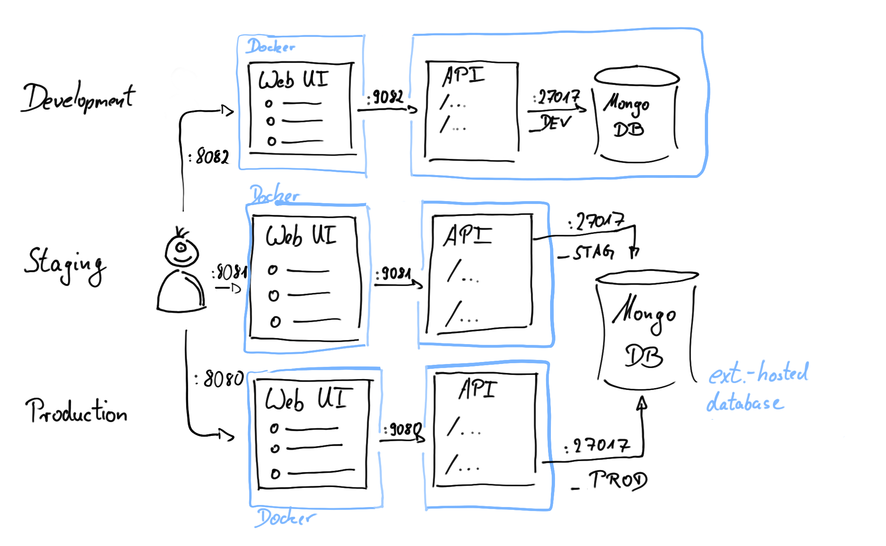

# TodoService

## Introduction

## Installation

### Tested Operating Systems

* Ubuntu
* Rasperry Pi B+

### Requirements

* docker
* docker-compose

### Using Dockerhub

### Build your own containers

`docker-compose build`

## Running the ToDo Service

### Deployment Diagram

### Deployment: Production

`docker-compose -f docker-compose.yml -f docker-compose.prod.yml up -d`

### Deployment: Staging

`docker-compose -f docker-compose.yml -f docker-compose.stag.yml up -d`

### Deployment: Development

`docker-compose -f docker-compose.yml -f docker-compose.dev.yml up`

## Usage

## To be Done (hah!)

* Initialize Vue.js frontend (project setup + build)
* Create a first, visual list of items
* How to do tests within Vue.js?
* Fill README.md with description and screenshots
* Once a minimal functionality is established, create a development branch and
  protect the "main" from direct pushes
